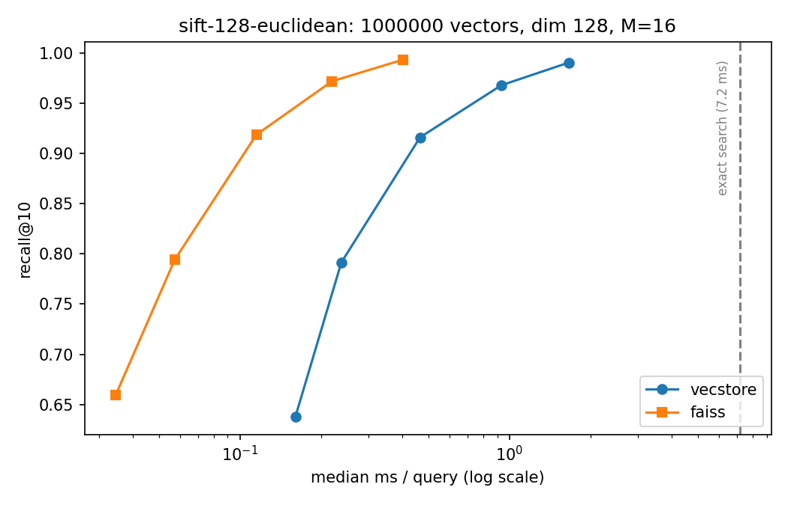
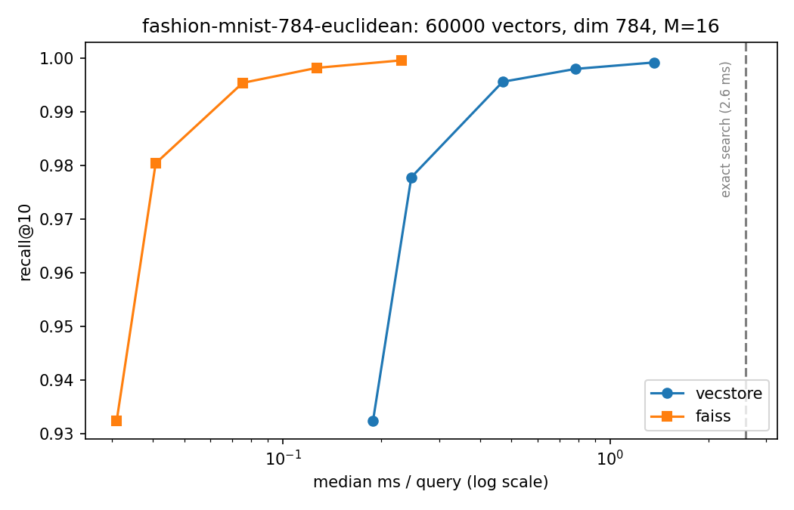

# vector-search-engine

Approximate nearest neighbor search engine built from scratch — the HNSW graph
index implemented in Python/NumPy and benchmarked against FAISS on standard ANN
datasets, up to one million vectors. No search library does the searching: the
layered graph, the insert heuristic and the query algorithm all live in this
repo, in readable NumPy.

## Results

Both indexes built with M=16, ef_construction=100; single thread; median
latency over 500 queries; recall scored against the official ann-benchmarks
ground truth. Reproduce with `python benchmarks/compare.py --dataset <name>`
(datasets download on first run).

### SIFT — 1,000,000 vectors, dim 128

| ef | recall@10 (vecstore) | recall@10 (faiss) | ms/query (vecstore) | ms/query (faiss) |
|---:|---:|---:|---:|---:|
| 10 | 0.638 | 0.659 | 0.16 | 0.03 |
| 20 | 0.791 | 0.794 | 0.24 | 0.06 |
| 50 | 0.916 | 0.919 | 0.47 | 0.11 |
| 100 | 0.968 | 0.972 | 0.93 | 0.22 |
| 200 | 0.990 | 0.993 | 1.66 | 0.40 |

Exact search costs 7.2 ms/query here. At 99% recall this index answers in
1.66 ms — 4.3x faster than exact search — and the gap widens with dataset
size: exact search scales linearly, graph search roughly logarithmically.

### Fashion-MNIST — 60,000 vectors, dim 784

| ef | recall@10 (vecstore) | recall@10 (faiss) | ms/query (vecstore) | ms/query (faiss) |
|---:|---:|---:|---:|---:|
| 10 | 0.932 | 0.932 | 0.19 | 0.03 |
| 20 | 0.978 | 0.980 | 0.25 | 0.04 |
| 50 | 0.996 | 0.995 | 0.47 | 0.08 |
| 100 | 0.998 | 0.998 | 0.78 | 0.13 |
| 200 | 0.999 | 1.000 | 1.36 | 0.23 |

### Reading these honestly

Recall tracks FAISS within a few thousandths at every operating point — same
algorithm, same parameters, same graph quality. Latency sits 4-6x behind
FAISS's C++, which is the price of NumPy per graph hop. Build time for 1M
vectors: 19 min here vs 3 min for FAISS, single-threaded both.

## Status

Work in progress — web playground and a compact graph layout on the way.
