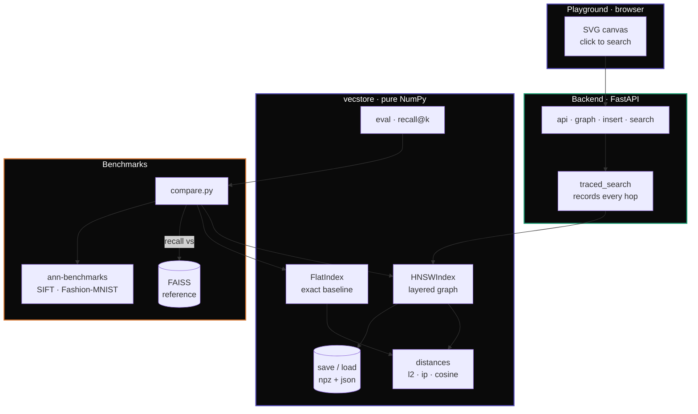
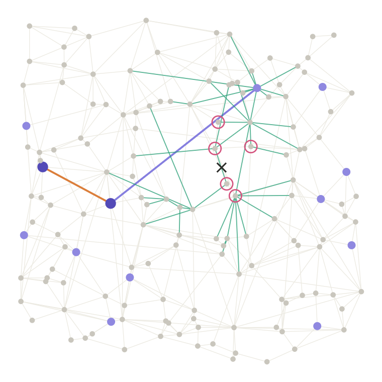

<div align="center">

# vector-search-engine

**An HNSW approximate-nearest-neighbor index, built from scratch in pure NumPy — and benchmarked honestly against FAISS on a million vectors.**

[](https://www.python.org/)
[](https://numpy.org/)
[](https://github.com/facebookresearch/faiss)
[](https://fastapi.tiangolo.com/)
[](https://github.com/Sparshg3011/vector-search-engine/actions)
[](LICENSE)

[Features](#features) · [Architecture](#architecture) · [Results](#results) · [Quick Start](#quick-start) · [How It Works](#how-it-works) · [API Reference](#api-reference)

</div>

---

## About

`vector-search-engine` implements the **Hierarchical Navigable Small World (HNSW)** graph index — the algorithm behind most modern vector databases — from the ground up in Python and NumPy. No search library does the searching: the layered graph, the neighbor-selection heuristic, the greedy-plus-beam query, persistence, and the benchmark harness are all in this repo, in readable code.

The deliverable is not "a faster FAISS" — it's an **honest recall-vs-latency curve**. On a million SIFT vectors this index matches FAISS's recall to within a few thousandths at every operating point, and a browser [playground](#playground) lets you watch a query descend the graph layer by layer.

> **Headline:** 0.99 recall@10 at 1.66 ms/query on 1,000,000 vectors — recall on par with FAISS, all in pure NumPy.

---

## Features

| Feature | Description |
|:--------|:------------|
| **HNSW index from scratch** | Layered navigable graph — random level assignment, greedy descent, and an `ef`-wide beam search at layer 0. No `faiss`, `hnswlib`, or `annoy` in the search path. |
| **Neighbor-selection heuristic** | The paper's diversity rule (keep a link only if it opens a new direction) — measured to lift recall from **0.75 → 0.96** on clustered data. |
| **Exact baseline + recall eval** | A brute-force `FlatIndex` provides ground truth; `recall@k` grades the approximate index against it. |
| **Three distance metrics** | Squared L2 (float64 accumulation, overflow-safe), inner product, and cosine, behind one registry. |
| **Persistence, no pickle** | `save`/`load` to a single `.npz` (vectors) + JSON (graph, params, RNG state) — portable and safe to open. |
| **Honest FAISS benchmark** | Same data, same `M`/`ef_construction`, single thread, median latency, official ann-benchmarks ground truth — up to 1M vectors. |
| **Interactive playground** | A FastAPI + SVG demo: click the map, watch the search hop across layers and fan out on layer 0. |
| **54 tests, green CI** | Every push runs the suite on GitHub Actions, including a statistical test of the level distribution and a recall-vs-FAISS check. |

---

## Architecture



### Query flow

```
   query vector
        │
        ▼
 ┌────────────┐   greedy hops    ┌────────────┐   drop a layer   ┌────────────┐
 │  layer 2   │ ───────────────▶ │  layer 1   │ ───────────────▶ │  layer 0   │
 │  entry pt  │  long jumps      │  medium    │  shorter hops    │  ef-wide   │
 └────────────┘                  └────────────┘                  └─────┬──────┘
   sparse "highway"                                                    │ top-k
   few nodes                                                           ▼
                                                              nearest neighbors
```

---

## Results

Both indexes built with `M=16`, `ef_construction=100`; single thread; median latency over 500 queries; recall scored against the **official ann-benchmarks ground truth**. Reproduce with `python benchmarks/compare.py --dataset <name>`.

### SIFT — 1,000,000 vectors, dim 128

| ef | recall@10 (vecstore) | recall@10 (faiss) | ms/query (vecstore) | ms/query (faiss) |
|---:|:--------------------:|:-----------------:|:-------------------:|:----------------:|
| 10  | 0.638 | 0.659 | 0.16 | 0.03 |
| 20  | 0.791 | 0.794 | 0.24 | 0.06 |
| 50  | 0.916 | 0.919 | 0.47 | 0.11 |
| 100 | 0.968 | 0.972 | 0.93 | 0.22 |
| 200 | **0.990** | 0.993 | **1.66** | 0.40 |

<div align="center">
  
</div>

Exact brute-force search costs **7.2 ms/query** on this machine. At 99% recall this index answers in **1.66 ms — 4.3× faster than exact** — and the gap widens with dataset size (exact search scales linearly, graph search roughly logarithmically).

### Fashion-MNIST — 60,000 vectors, dim 784

| ef | recall@10 (vecstore) | recall@10 (faiss) | ms/query (vecstore) | ms/query (faiss) |
|---:|:--------------------:|:-----------------:|:-------------------:|:----------------:|
| 10  | 0.932 | 0.932 | 0.19 | 0.03 |
| 20  | 0.978 | 0.980 | 0.25 | 0.04 |
| 50  | 0.996 | 0.995 | 0.47 | 0.08 |
| 100 | 0.998 | 0.998 | 0.78 | 0.13 |
| 200 | 0.999 | 1.000 | 1.36 | 0.23 |

<div align="center">
  
</div>

**Reading it honestly:** recall tracks FAISS to within a few thousandths at every operating point — same algorithm, same parameters, same graph quality. Latency sits ~4–6× behind FAISS's hand-tuned C++, which is the price of NumPy per graph hop. Building 1M vectors took 19 min here vs 3 min for FAISS, single-threaded.

### Playground

Click anywhere on the 2-D map and watch the search descend: an orange hop on the top layer, purple hops on layer 1, teal exploration across layer 0, and pink rings on the `k` nearest neighbors found. The `ef` slider trades recall for speed live.

<div align="center">
  
</div>

---

## Quick Start

### Prerequisites

- **Python** 3.10+

### 1. Install

```bash
git clone https://github.com/Sparshg3011/vector-search-engine.git
cd vector-search-engine
python -m venv .venv && source .venv/bin/activate
pip install -e ".[dev]"
```

### 2. Use the index

```python
import numpy as np
from vecstore import HNSWIndex

index = HNSWIndex(dim=128, M=16, ef_construction=100)
for vec in np.random.randn(10_000, 128).astype("float32"):
    index.add(vec)

ids, dists = index.search(np.random.randn(128), k=10, ef=50)
index.save("index.npz")           # portable: npz + json, no pickle
index = HNSWIndex.load("index.npz")
```

### 3. Run the tests

```bash
pytest -q                          # 54 tests
```

### 4. Run the benchmark (downloads the dataset on first run)

```bash
pip install -e ".[bench]"
python benchmarks/compare.py --dataset fashion-mnist-784-euclidean
```

### 5. Launch the playground

```bash
pip install -e ".[demo]"
uvicorn playground.server:app      # → http://localhost:8000
```

---

## How It Works

HNSW is a **skip list generalized to a graph**. Each inserted vector is assigned a random level from an exponential distribution — most live only on layer 0, a few reach the sparse upper layers.

1. **Insert** — draw a level, greedily descend from the entry point to that level, then at each layer find the `ef_construction` closest nodes and link to the best `M` of them (bidirectionally). Over-full nodes are pruned back.
2. **Neighbor selection** — a candidate becomes a link only if it is closer to the new node than to every neighbor already chosen. This keeps links *diverse* (pointing in different directions) instead of clustered, which is what makes distant regions reachable.
3. **Search** — greedy-hop down the upper "highway" layers to get near the query cheaply, then run a bounded best-first search on layer 0 with a candidate heap of size `ef`, and return the `k` closest.

Two knobs define the whole recall/latency trade-off: **`M`** (links per node — graph richness) and **`ef`** (beam width at query time — how hard you look). The [results](#results) above are those two knobs, swept.

---

## Project Structure

```
vector-search-engine/
├── vecstore/                  # the library — pure NumPy, zero search deps
│   ├── hnsw.py                #   HNSW index: insert, search, heuristic, save/load
│   ├── flat.py                #   exact brute-force baseline (ground truth)
│   ├── distances.py           #   l2 · inner product · cosine
│   ├── eval.py                #   recall@k
│   ├── trace.py               #   traced_search — records every hop for the demo
│   └── datasets.py            #   ann-benchmarks dataset loader
│
├── benchmarks/
│   ├── compare.py             #   vecstore vs FAISS → recall/latency curve
│   ├── memory.py              #   footprint breakdown (vectors vs graph)
│   └── ef_sweep.py            #   quick ef sweep on random data
│
├── playground/
│   ├── server.py              #   FastAPI: graph · insert · search
│   └── static/index.html      #   single-file SVG frontend, no build step
│
├── results/                   #   committed benchmark curves + numbers
├── tests/                     #   54 tests
└── Dockerfile                 #   deploy the playground (CPU-only)
```

---

## API Reference

### Python library

| Call | Description |
|:-----|:------------|
| `HNSWIndex(dim, metric="l2", M=16, ef_construction=100, seed=0)` | Create an index. `metric` ∈ `{l2, ip, cosine}`. |
| `index.add(vector)` | Insert one vector; returns its node id. |
| `index.search(query, k=10, ef=50)` | Return `(ids, distances)` of the `k` nearest. |
| `index.save(path)` / `HNSWIndex.load(path)` | Persist / restore (npz + json). |
| `FlatIndex(dim, metric="l2")` | Exact brute-force index for ground truth. |
| `recall(true_ids, got_ids)` | Fraction of true neighbors retrieved. |

### Playground HTTP API

| Method | Endpoint | Description |
|:-------|:---------|:------------|
| `GET`  | `/api/graph` | Nodes (with layer), per-layer edges, entry point |
| `POST` | `/api/search` | `{x, y, ef, k}` → results + per-layer hop trace + stats |
| `POST` | `/api/insert` | `{x, y}` → new node id and its assigned level |
| `POST` | `/api/reset` | `{n, seed}` → rebuild a fresh random index |

---

## Deployment

The playground is CPU-only with no API keys — it runs anywhere a container runs.

```bash
docker build -t vecstore-playground .
docker run -p 8000:8000 vecstore-playground     # → http://localhost:8000
```

On Railway or Fly.io, point the platform at the `Dockerfile`; it binds to `$PORT` automatically.

---

## Tech Stack

| Layer | Technology |
|:------|:-----------|
| Core index | Python 3.10+ · NumPy |
| Exact baseline | NumPy (brute force) |
| Benchmark reference | FAISS (`faiss-cpu`) |
| Datasets | ann-benchmarks (HDF5 via `h5py`) |
| Plotting | matplotlib |
| Playground API | FastAPI · Uvicorn |
| Frontend | Vanilla JS + inline SVG (no build step) |
| Tests / CI | pytest · GitHub Actions |

---

## Contributing

1. Fork the repository
2. Create your feature branch → `git checkout -b feat/amazing-feature`
3. Commit your changes → `git commit -m "feat: add amazing feature"`
4. Push to the branch → `git push origin feat/amazing-feature`
5. Open a Pull Request

---

## License

Released under the MIT License — see [LICENSE](LICENSE) for details.

---

<div align="center">

**[Back to Top](#vector-search-engine)**

</div>
