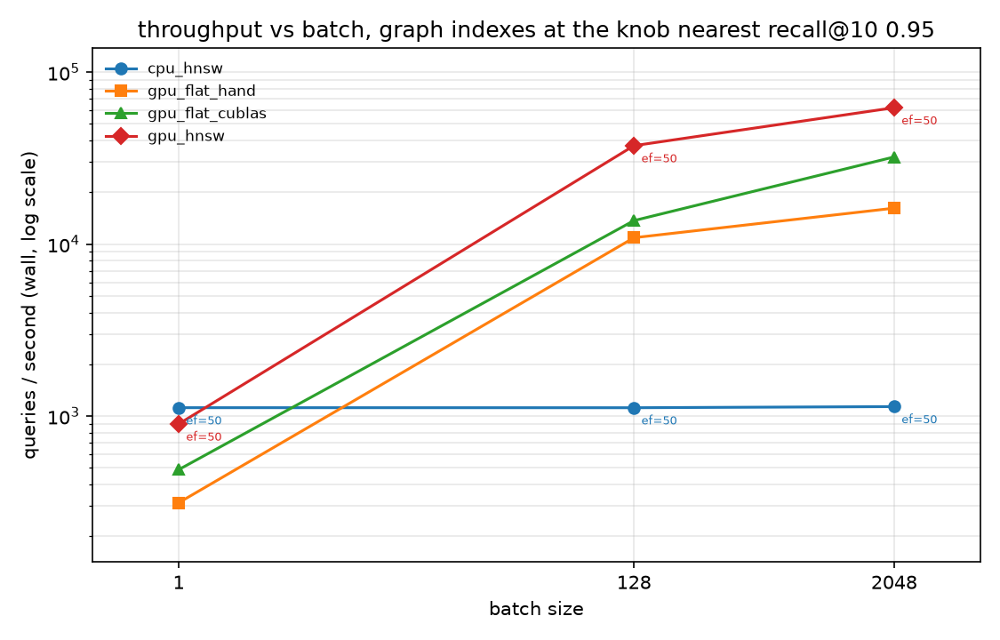
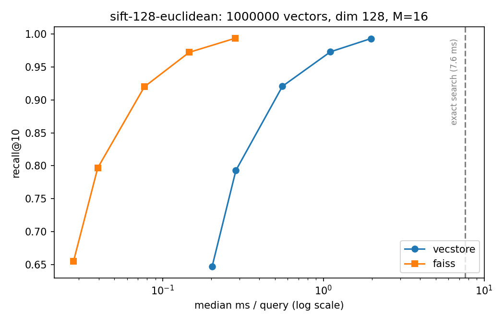
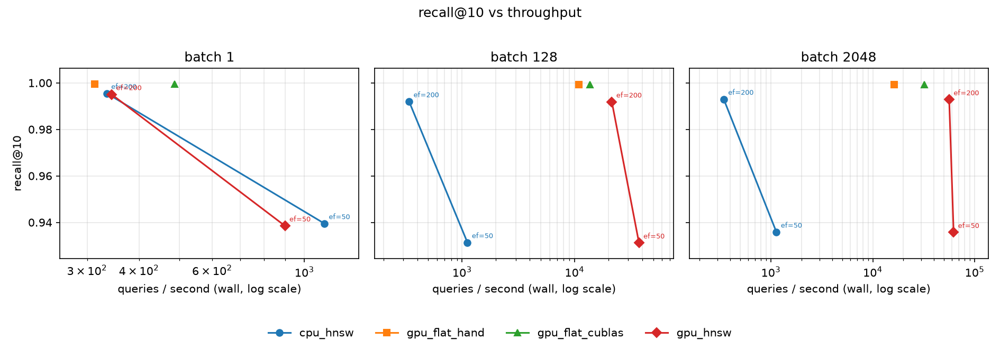
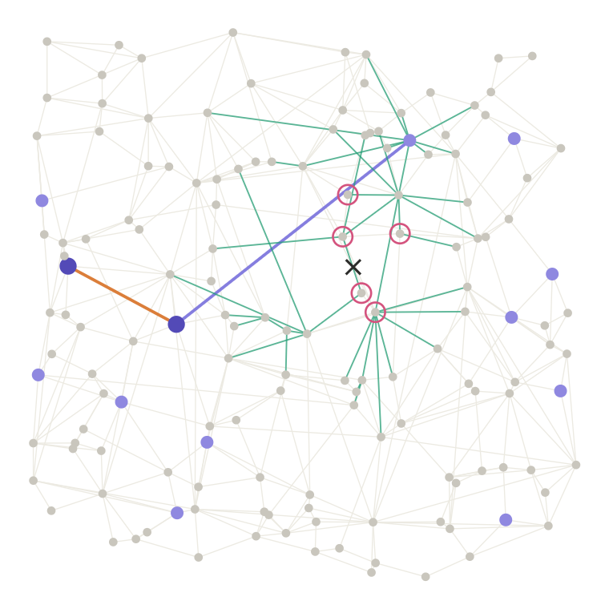

<div align="center">

# vector-search-engine

**An HNSW approximate-nearest-neighbor index built from scratch in NumPy and benchmarked honestly against FAISS on a million vectors — then ported to CUDA, where the same search answers over a hundred times more queries per second at the same recall.**

[](https://www.python.org/)
[](https://numpy.org/)
[](#gpu-results)
[](https://github.com/facebookresearch/faiss)
[](https://fastapi.tiangolo.com/)
[](https://github.com/Sparshg3011/vector-search-engine/actions)
[](LICENSE)

[Interactive demo](https://sparshg3011.github.io/cuda-hnsw/) · [CPU Results](#cpu-results) · [GPU Results](#gpu-results) · [How It Works](#how-it-works) · [Usage](#usage) · [API Reference](#api) · [Limitations](#limitations)

</div>

---

**CPU.** On SIFT-1M the index reaches 0.993 recall@10 at 1.97 ms per query on one thread. FAISS's HNSW, built with the same parameters, reaches the same recall at 0.28 ms.

**GPU.** On an NVIDIA L40S the same index answers 56,265 queries per second at batch 2,048. That is 163× the CPU of the same node at the same recall (0.993). One query at a time, the GPU is no faster: 2.91 ms against 2.99 ms.

<p align="center">
  
</p>

SIFT-1M on an L40S at `ef=50`. The CPU answers queries one after another, so its line is flat. A batch keeps the whole GPU busy, so the GPU lines climb.

An [interactive walkthrough](https://sparshg3011.github.io/cuda-hnsw/) of the GPU port runs in the browser.

## CPU results

Both indexes use `M=16` and `ef_construction=100` on a single thread. Latency is the median over 500 queries on an Apple M5. Recall is scored against the ground truth that ships with ann-benchmarks. `python benchmarks/compare.py --dataset <name>` reproduces a table.

**SIFT, 1,000,000 vectors, 128 dimensions**

| ef | recall@10, vecstore | recall@10, FAISS | ms/query, vecstore | ms/query, FAISS |
|---:|:---:|:---:|:---:|:---:|
| 10  | 0.647 | 0.656 | 0.20 | 0.03 |
| 20  | 0.793 | 0.797 | 0.29 | 0.04 |
| 50  | 0.921 | 0.920 | 0.56 | 0.08 |
| 100 | 0.973 | 0.972 | 1.11 | 0.15 |
| 200 | 0.993 | 0.993 | 1.97 | 0.28 |

<p align="center">
  
</p>

**Fashion-MNIST, 60,000 vectors, 784 dimensions**

| ef | recall@10, vecstore | recall@10, FAISS | ms/query, vecstore | ms/query, FAISS |
|---:|:---:|:---:|:---:|:---:|
| 10  | 0.932 | 0.932 | 0.26 | 0.04 |
| 20  | 0.978 | 0.981 | 0.36 | 0.06 |
| 50  | 0.996 | 0.995 | 0.69 | 0.11 |
| 100 | 0.998 | 0.998 | 1.15 | 0.18 |
| 200 | 0.999 | 1.000 | 1.89 | 0.30 |

- Recall is within 0.01 of FAISS at every setting, and within 0.001 from `ef=50` up. Same algorithm, same parameters, same graph quality.
- Latency is about 7× FAISS's. That is the cost of doing each graph hop in NumPy instead of C++.
- Exact search on the same machine takes 7.6 ms per query on SIFT, so at 0.993 recall the index is 3.8× faster than brute force.
- Building the SIFT index takes 24 minutes, against 2 minutes for FAISS, both single-threaded.
- The neighbor-selection heuristic matters on clustered data. Compared with keeping the `M` closest candidates, it raises recall@10 from 0.75 to 0.96 on a synthetic clustered set.

## GPU results

The port tests one claim. A graph walk is sequential, so a single query cannot run faster on a GPU. Throughput has to come from running thousands of walks at once.

SIFT-1M, the 10,000 official queries, `k=10`, recall against fp64 ground truth. Each figure is the median of 20 timed runs after warmup; batch 1 uses 200 distinct queries. Wall time includes host-device copies. Kernel time is CUDA-event time on the device alone. The CPU rows are one core of the same node, so every comparison is within one machine. `sbatch gpu/slurm/discovery.sbatch` reproduces the run, and the raw output is in [`gpu/bench/results/`](gpu/bench/results/).

**One NVIDIA L40S**

| search | batch | recall@10 | ms/query, wall | ms/query, kernel | queries/s |
|:--|--:|--:|--:|--:|--:|
| CPU HNSW, NumPy, `ef=200` | 1 | 0.995 | 2.988 | | 335 |
| GPU HNSW, K3, `ef=200` | 1 | 0.995 | 2.907 | 2.6474 | 344 |
| CPU HNSW, NumPy, `ef=200` | 2,048 | 0.993 | 2.904 | | 344 |
| GPU HNSW, K3, `ef=200` | 2,048 | 0.993 | 0.018 | 0.0026 | 56,265 |
| GPU HNSW, K3, `ef=50` | 2,048 | 0.936 | 0.016 | 0.0009 | 62,188 |
| GPU brute force, K1 + K2 | 2,048 | 0.999 | 0.062 | 0.0593 | 16,186 |
| GPU brute force, cuBLAS + K2 | 2,048 | 0.999 | 0.031 | 0.0286 | 32,146 |

<p align="center">
  
</p>

- At batch 1 the GPU takes 2.91 ms and the CPU 2.99 ms. No gain, as expected.
- At batch 2,048 the same search runs at 163× the CPU's throughput with the same recall. The kernel accounts for 0.0026 ms of the 0.018 ms per query. Most of the rest, 0.015 ms, is the upper-layer descent, which still runs on the host.
- Brute force on the GPU beats the CPU's graph search outright. With cuBLAS distances and K2 selection it answers 32,146 queries per second at 0.999 recall, 93× the CPU. The hand-written distance kernel K1 is 2.0× slower than cuBLAS on the same job.
- Brute force scores 0.999 rather than 1.000 because SIFT distances are integers. 137 of the 10,000 queries have an exact tie at tenth place, and a tie broken differently counts as a miss.

**The same code on two cards**

| GPU | batch 1, GPU vs CPU (ms) | HNSW at batch 2,048 (queries/s) | vs CPU | recall@10 | cuBLAS brute force (queries/s) |
|:--|--:|--:|--:|--:|--:|
| L40S | 2.91 vs 2.99 | 56,265 | 163× | 0.993 | 32,146 |
| A40 | 4.43 vs 3.82 | 44,060 | 155× | 0.993 | 18,405 |

Each row is one job on one node, so the CPU figures differ between rows. The result has the same shape on both cards.

### Verification

- 76 tests hold each kernel to fp64 NumPy or to the CPU index. The tolerances were fixed in [`gpu/SPEC.md`](gpu/SPEC.md) before the first GPU run. All pass on an A40 and an L40S.
- `compute-sanitizer` memcheck and racecheck report no errors and no hazards. During bring-up racecheck found one real hazard in K3, an unordered read and write of the beam's expanded flags. It never produced a wrong result, and it is fixed.
- The GPU and CPU searches agree. Replayed over all 10,000 queries, their recall differs by at most 0.0005 against a gate of 0.01.
- Running the GPU benchmark exposed a bug in the CPU index. Exact duplicate vectors (29,076 rows in SIFT-1M) formed closed two-node islands because the heuristic rejected ties, and 8 of the 10,000 queries returned fewer than `k` results. The fix is one comparison. Both indexes were rebuilt and every CPU number above was measured again.

## How it works

### HNSW

HNSW is a skip list generalized to a graph. Each inserted vector draws a level from an exponential distribution. Most vectors live only on layer 0, and a few reach the sparse upper layers.

1. **Insert.** Descend greedily from the entry point to the new node's level. At each layer from there down, find the `ef_construction` closest nodes and link to the best `M` of them in both directions. Nodes that end up over-full are pruned back.
2. **Neighbor selection.** A candidate becomes a link only if it is closer to the new node than to every neighbor already chosen. Links then point in different directions instead of into one cluster, which keeps distant regions reachable.
3. **Search.** Hop greedily down the upper layers to get near the query cheaply. On layer 0, run a best-first search with a candidate list of size `ef` and return the `k` closest.

Two parameters set the trade-off between recall and latency: `M`, the links per node, and `ef`, the width of the search at query time.

### The CUDA port

`export_index` writes a saved index as fp16 rows padded to a multiple of 8, an int32 layer-0 adjacency table, and the upper layers as JSON. Three kernels sit behind a pybind11 extension.

- **K1, distance matrix.** Blocks of 16×16 threads. Each block copies 32-dimension chunks of its 16 queries and 16 base rows into shared memory once, and every thread reads them from there. Rows are stored in fp16 and accumulated in fp32, because SIFT's squared distances overflow fp16. The matrix is computed in chunks so that it never exceeds 2 GB.
- **K2, top-k.** Each row of the distance matrix is dealt across the threads of a block. Every thread keeps a sorted shortlist of `k`, and `k` rounds of an argmin reduction merge the shortlists.
- **K3, beam search.** One warp of 32 threads per query. The walk itself stays sequential, and each step's distance evaluations are split across the warp's 32 lanes and reduced. The visited set is an 8,192-slot hash table per query in global memory. That size came from measurement: a query at `ef=200` visits a median of 2,792 nodes of SIFT-1M (p95 3,547), about seven times what the first design assumed. The beam is a single sorted list of length `ef` in shared memory, and it expands exactly the nodes that the CPU's two-heap loop expands. The upper layers are walked on the host for the whole batch before launch.

[`gpu/SPEC.md`](gpu/SPEC.md) is the binding contract for the kernels. [`gpu/notes.md`](gpu/notes.md) logs the measurements behind each design decision.

## Usage

Python 3.10 or newer.

```bash
git clone https://github.com/Sparshg3011/vector-search-engine.git
cd vector-search-engine
python -m venv .venv && source .venv/bin/activate
pip install -e ".[dev]"
```

```python
import numpy as np
from vecstore import HNSWIndex

index = HNSWIndex(dim=128, M=16, ef_construction=100)
for vec in np.random.randn(10_000, 128).astype("float32"):
    index.add(vec)

ids, dists = index.search(np.random.randn(128), k=10, ef=50)
index.save("index.npz")
index = HNSWIndex.load("index.npz")
```

An index is saved as one `.npz` for the vectors plus JSON for the graph, parameters and RNG state. Nothing is pickled.

Tests and benchmark. The benchmark downloads its dataset on the first run.

```bash
pip install -e ".[dev,demo]"
pytest -q

pip install -e ".[bench]"
python benchmarks/compare.py --dataset fashion-mnist-784-euclidean
```

### Playground

Click anywhere on the 2-D map to run a search. The demo draws the hops on the upper layers, the exploration across layer 0, and the `k` neighbors found. The `ef` slider changes the search width live.

<p align="center">
  
</p>

```bash
pip install -e ".[demo]"
uvicorn playground.server:app      # http://localhost:8000
```

Or in a container. It is CPU-only and binds to `$PORT` when that is set.

```bash
docker build -t vecstore-playground .
docker run -p 8000:8000 vecstore-playground
```

### GPU

On USC's Discovery cluster. Compute nodes have no internet access, so the downloads happen on a login node. [`gpu/SPEC.md`](gpu/SPEC.md) has the exact steps.

```bash
bash gpu/setup_pod.sh --deps-only
python3 gpu/bench/fetch_queries.py sift-128-euclidean
sbatch --account=<project_id> gpu/slurm/discovery.sbatch     # build, tests, benchmark on an L40S
sbatch --account=<project_id> gpu/slurm/sanitize.sbatch      # memcheck and racecheck
```

On any machine with a CUDA 12 toolchain.

```bash
bash gpu/setup_pod.sh                 # dependencies, build, six environment checks
python3 -m pytest gpu/tests -v
python3 gpu/bench/run.py --gpu-index data/sift.gpu.npz --queries data/sift-128-euclidean-queries.npy
```

## API

**`vecstore`**

| Call | Description |
|:--|:--|
| `HNSWIndex(dim, metric="l2", M=16, ef_construction=100, seed=0)` | Create an index. `metric` is one of `l2`, `ip`, `cosine`. |
| `index.add(vector)` | Insert one vector and return its node id. |
| `index.search(query, k=10, ef=50)` | Return `(ids, distances)` of the `k` nearest. |
| `index.save(path)`, `HNSWIndex.load(path)` | Persist and restore. |
| `FlatIndex(dim, metric="l2")` | Exact brute-force index, used for ground truth. |
| `recall(true_ids, got_ids)` | Fraction of the true neighbors retrieved. |

**`vecstore_gpu`**, which needs the built extension

| Call | Description |
|:--|:--|
| `export_index(src, out, normalize=False)` | Turn a saved or live `HNSWIndex` into a `.gpu.npz`. |
| `load_gpu_index(path)`, `.validate()` | Read a `.gpu.npz` and check every invariant the kernels rely on. |
| `descend(index, queries)` | Walk the upper layers for a whole batch in NumPy and return each query's layer-0 entry point. |
| `DeviceIndex(vectors, dim, metric)` | Upload the rows to the GPU. Methods: `.set_graph(adjacency, degrees, entry)`, `.brute_force(queries, k, use_cublas)`, `.hnsw(queries, entries, k, ef)`, `.last_kernel_ms()`. |

## Repository layout

```
vecstore/            the library, NumPy only
  hnsw.py            index: insert, search, heuristic, save and load
  flat.py            exact brute-force baseline
  distances.py       l2, inner product, cosine
  eval.py            recall@k
  trace.py           traced_search, records every hop for the playground
  datasets.py        ann-benchmarks loader
benchmarks/          compare.py (vecstore against FAISS), memory.py, ef_sweep.py
gpu/
  kernels/           distances.cu, topk.cu, hnsw_search.cu
  src/               launchers and pybind11 bindings
  vecstore_gpu/      export, load, descend, and the built extension
  tests/             76 tests against NumPy and the CPU index
  bench/             run.py, baselines.py, plot.py, results/
  slurm/             Discovery job scripts
  tools/             precheck.py, a structural compile that needs no nvcc
  SPEC.md            contract for the kernels
  notes.md           engineering log
playground/          FastAPI server and a single-file SVG frontend
results/             CPU benchmark numbers and figures
tests/               54 tests, run on every push
```

## Limitations

- The CPU index is a NumPy reference implementation. It matches FAISS's recall at about 7× the latency and 12× the build time. It supports insertion and search only. There is no delete.
- K1 is 2.0× slower than cuBLAS on the L40S and 2.7× on the A40. It has not been profiled yet.
- The upper-layer descent runs on the host. At batch 2,048 it is 0.015 ms of the 0.018 ms per query, several times the kernel itself.
- There is no comparison yet against FAISS-GPU or cuVS.
- The GPU path uses one device, and the index has to fit in its memory. The kernels support `l2` and `ip`; cosine is handled by normalizing the vectors at export. `ef` is limited to 256.

## License

MIT. See [LICENSE](LICENSE).
